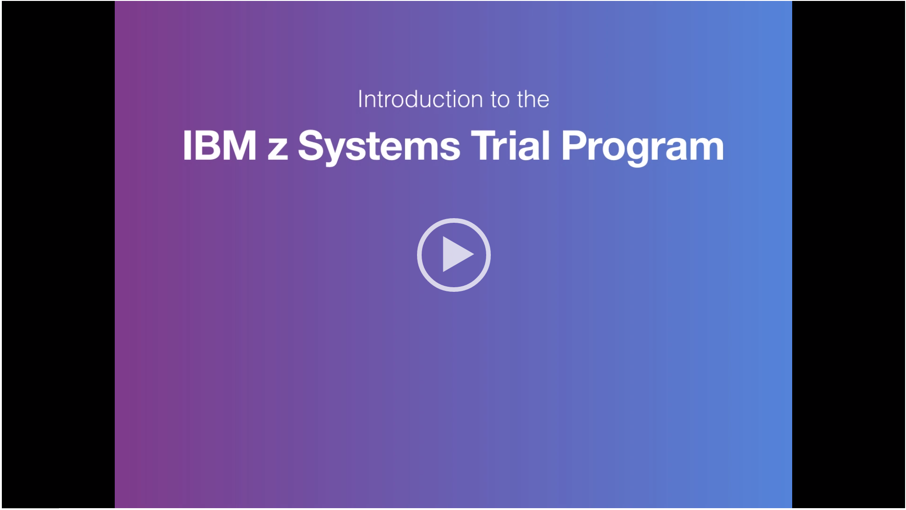

# z-os-Application-Discovery-and-Delivery-Intelligence
This journey describes the steps to try out the z/OS Assess and improve the maintainability of a COBOL application trial. 

## Overview
Use IBM® Application Discovery (AD), IBM Application Delivery Intelligence (ADI), and IBM Developer for z Systems™ to identify maintainability issues and update unreachable code in an application.

This trial guides you through the steps in roughly 30 minutes. By the end of the session, you'll know how to:
* **Use IBM Application Discovery to evaluate the maintainability of an application's source code.**
* **View trend data and metrics for an application's overall health.**
* **Rebuild the IBM Application Discovery & Delivery Intelligence repository after you apply a code fix, and verify that the application's maintenance status has improved.**

No previous knowledge of application architecture or programming is needed, but there are some important terms and concepts that you should familiarize yourself with before you begin:
* IBM Application Discovery is a static code analysis tool that supplies graphical visualizations and reports on applications, features a dashboard with multiple categories of application metrics, and integrates with third-party source code and tooling to provide application infrastructure mapping and automatic repository updates.
* IBM Application Delivery Intelligence is a web-based analysis tool that assists with test optimization, allows for earlier problem detection, and allows for more thorough governance of maintenance.
* Maintenance status is the ease with which an application can be maintained, based on code coverage, complexity, and other important metrics.
* Unreachable code is a section of a program's code that you cannot run, because there is no control flow path to the code from the rest of the program.

## Topics covered in the trial
* **Viewing the Application Delivery Intelligence Analysis**
* **Comparing Analysis Statistics**
* **Accessing source code from Application Discovery**
* **Finding the source code within a project**
* **Reading the Unused Routines within Programs report**
* **Identifying the unused routines in a Program Flow graph**
* **Overwriting source code to eliminate problematic routines**
* **Rebuilding the project in the repository**
* **Confirming that the source code is updated in the repository**
* **Updating Application Delivery Intelligence**

## How long is the trial?

Your trial environment will expire three days after it is provisioned. At the end of the trial period, your environment will be automatically deprovisioned and all account and system data will be deleted.

## Getting started

The starting point is the [IBM Trial homepage](https://www-03.ibm.com/systems/z/resources/trials.html). On this page, navigate to the **Application Discovery and Delivery Intelligence** panel on the left. In the panel, click **"register now"** button and follow the steps. If everything goes through, you shoud see a screen titled "Congradulations, your environment is on its way".

## Now what?
Now we wait.   
The same screen will tell you it takes hours for the provision to be done. So wait for an email notification from "zTrial".

## How do I access the trial?

The trial is available through a Windows-based remote desktop environment.

In order to access the trial environment, you must be able to connect to a remote system over a network connection.

    Windows users should use the built-in Remote Desktop Connection application.
    Mac users should use the Remote Desktop app, available from the App Store.
    Linux users have several choices of remote desktop application, which might vary between distribution.
    
The email from zTrial has more detailed information on your account. It provides the ip and credentials to access the remote desktop. Simply follow the instrutions and start the remote desktop.

Click on the following video to get more details on how to conduct the trial.

